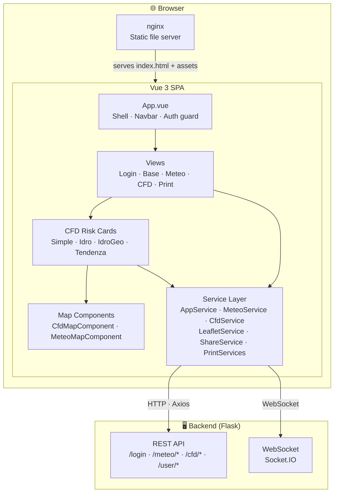
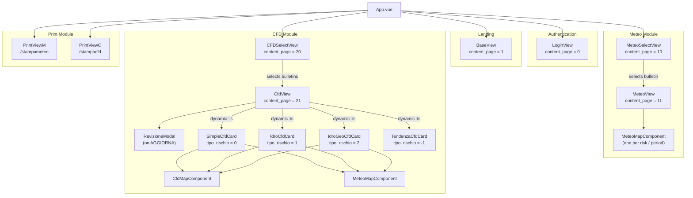
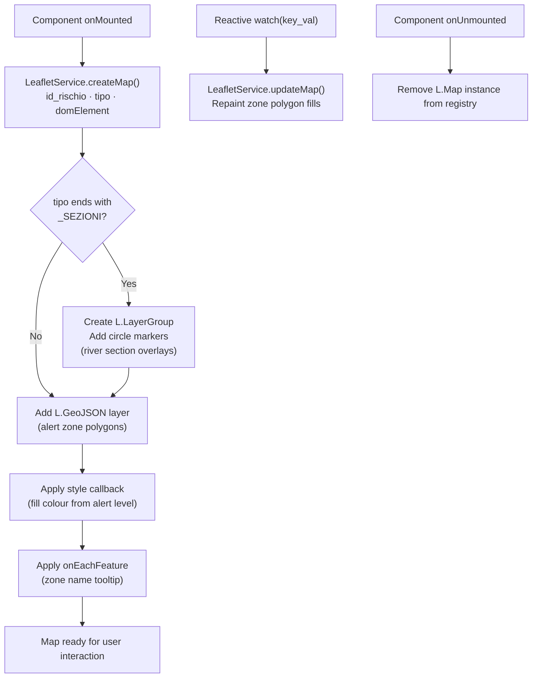
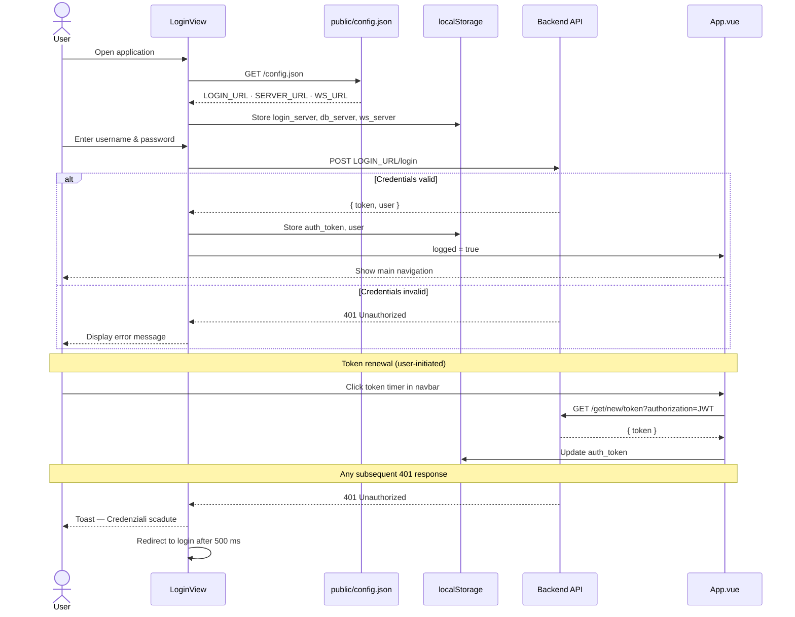
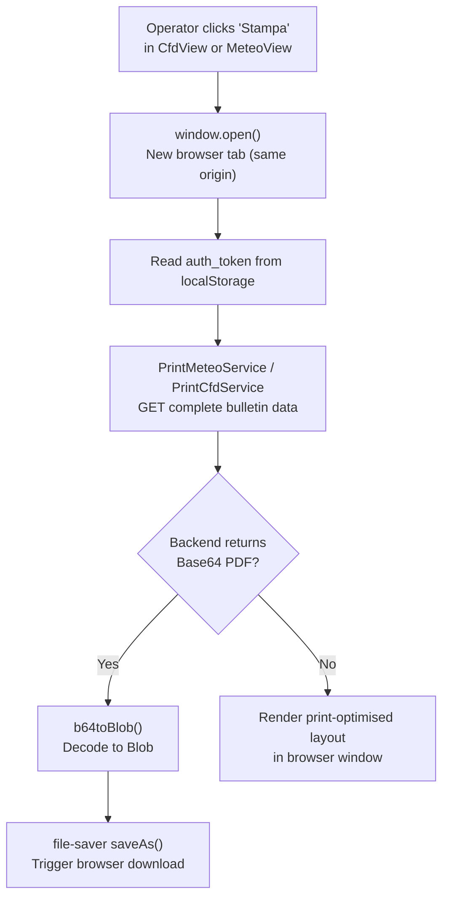

# Architecture

[← Back to README](README.md) · [Installation](INSTALLATION.md) · [Components](COMPONENTS.md) · [API Services](API_SERVICES.md) · [User Guide](USER_GUIDE.md)

> **Audience:** Developers contributing to, maintaining, or integrating with this codebase.

This document describes the internal structure of the **Bollettino Multirischio** frontend: the overall system topology, application bootstrap sequence, routing strategy, component hierarchy, service layer design, state management approach, map infrastructure, real-time communication, authentication flow, print architecture, and styling conventions.

---

## Table of Contents

1. [High-Level Architecture](#high-level-architecture)
2. [Application Bootstrap](#application-bootstrap)
3. [Routing](#routing)
4. [Component Hierarchy](#component-hierarchy)
5. [Service Layer](#service-layer)
6. [State Management](#state-management)
7. [Map Architecture (LeafletService)](#map-architecture-leafletservice)
8. [Real-Time Communication](#real-time-communication)
9. [Authentication Flow](#authentication-flow)
10. [Print Architecture](#print-architecture)
11. [CSS & Styling Strategy](#css--styling-strategy)

---

## High-Level Architecture

The application is a Vue 3 SPA served as static files by nginx. All data is fetched from a separate Flask backend over HTTP (Axios) and WebSocket (Socket.IO). There is no server-side rendering.



---

## Application Bootstrap

`src/main.js` performs all global setup in order:

1. Creates the Vue application (`createApp(App)`).
2. Imports global CSS: UIkit, `dashboard.css`, `personal.css`.
3. Imports global JS: jQuery, UIkit JS + icons, jwt-decode, toastr.
4. Registers the `<font-awesome-icon>` component globally with the required icon subset.
5. Installs a global Vue error handler that logs component errors to the console.
6. Mounts the app on `<div id="app">` in `index.html`.

> **Design note:** The Vue Router instance defined in `src/router/index.js` is declared but intentionally **not registered** via `app.use(router)`. Navigation between main sections is managed in `App.vue` by toggling a reactive `content_page` integer, which keeps the entire application within a single URL. Vue Router is only used for the print views (`/stampameteo`, `/stampacfd`), which open in separate browser windows.

---

## Routing

Although `vue-router` is configured, only the print views are reachable via URL routing in the current implementation. Main navigation is driven by `content_page` in `App.vue`.

| Route | Component | Notes |
|-------|-----------|-------|
| `/` | `BaseView` | Landing / home |
| `/base` | `BaseView` | Alias |
| `/dashboard` | `StatsView` | Statistics (placeholder) |
| `/meteo` | `MeteoView` | Meteo bulletin editor |
| `/cfd` | `CfdView` | CFD bulletin editor |
| `/stampameteo` | `PrintViewM` | Meteo print — opens in new tab |
| `/stampacfd` | `PrintViewC` | CFD print — opens in new tab |
| `/*` | Redirect to `/` | 404 catch-all |

### `content_page` Switch Values (App.vue)

| Value | View shown |
|-------|-----------|
| `0` | `LoginView` |
| `1` | `BaseView` |
| `10` | `MeteoSelectView` (→ `MeteoView` after selecting a bulletin) |
| `11` | `MeteoView` |
| `20` | `CFDSelectView` (→ `CfdView` after selecting) |
| `21` | `CfdView` |

---

## Component Hierarchy



### Dynamic Card Selection in CfdView

`CfdView` selects which card component to render based on the current `rischio.tipo_rischio` value:

| `tipo_rischio` | Component rendered |
|---------------|-------------------|
| `0` | `SimpleCfdCard` |
| `1` | `IdroCfdCard` |
| `2` | `IdroGeoCfdCard` |
| `-1` | `TendenzaCfdCard` |

---

## Service Layer

All services live in `src/services/`. They are plain JavaScript classes (not Vue composables) and are instantiated directly inside components with `new ServiceName()`.

### `service.js` — Base URL Resolution

```js
const SERVER_URL = localStorage.getItem("db_server");
const LOGIN_URL  = localStorage.getItem("login_server");
const WS_URL     = localStorage.getItem("ws_server");
```

The three keys are written to `localStorage` by `LoginView` after reading `public/config.json` at startup. All other services import `SERVER_URL` from this module.

### Service Responsibility Matrix

| Service | Instantiation | Responsibility |
|---------|--------------|---------------|
| `AppService` | Per-component `new` | Token renewal, profile-picture upload |
| `MeteoService` | Per-component `new` | All meteo bulletin CRUD |
| `CfdService` | Per-component `new` | All CFD bulletin CRUD, soil state, section levels |
| `PrintMeteoService` | Per-component `new` | Fetch meteo print data |
| `PrintCfdService` | Per-component `new` | Fetch all CFD data for print |
| `LeafletService` | **Singleton** (module-level `new`) | Map creation, GeoJSON layers, section markers, alert colouring |
| `ShareService` | **Singleton** (module-level `new`) | Cross-component: alert levels list, window token |

---

## State Management

The application uses a **lightweight local state** approach rather than a global store:

| Mechanism | Usage |
|-----------|-------|
| Vue `ref` / `reactive` | Per-component reactive state |
| `localStorage` | Persisted auth token (`auth_token`), user object (`user`), server URLs (`db_server`, `login_server`, `ws_server`) |
| `ShareService` singleton | Shared non-reactive state (alert levels, token reference) accessible from any service/component |
| Pinia | Listed as a dependency but not actively used in current code |

### localStorage Keys

| Key | Type | Set by | Read by |
|-----|------|--------|---------|
| `auth_token` | `string` | `LoginView` on login | All service classes |
| `user` | `JSON string` | `LoginView` on login | `MeteoMapComponent`, `CfdMapComponent` |
| `db_server` | `string` | `LoginView` on config load | `service.js` |
| `login_server` | `string` | `LoginView` on config load | `service.js` |
| `ws_server` | `string` | `LoginView` on config load | `service.js` |

---

## Map Architecture (LeafletService)

`LeafletService` is a singleton responsible for the entire lifecycle of all Leaflet maps in the application.

### Internal Data Structures

```
LeafletService {
  maps_CFD:          { [id_rischio]: L.Map }
  maps_METEO:        { [id_rischio]: L.Map }
  geoJsonLayer_CFD:  { [id_rischio]: L.GeoJSON }
  geoJsonLayer_METEO:{ [id_rischio]: L.GeoJSON }
  sezioniLayer_CFD:  { [id_rischio]: L.LayerGroup }
  sezioniLayer_METEO:{ [id_rischio]: L.LayerGroup }
  filter_CFD:        { [id_rischio]: Function }
  filter_METEO:      { [id_rischio]: Function }
  geoJsonData:       FeatureCollection | null   // alert zones
  sezioniData:       Array | null               // river sections
  meteo_allerta:     Array                       // meteo alert data
  cfd_allerta:       Array                       // CFD alert data
  updated:           { CFD: [], METEO: [] }
}
```

### Map Creation Flow



### Map Types

| `tipo` string | CFD/METEO | Sezioni overlay |
|---------------|-----------|-----------------|
| `'CFD'` | CFD | No |
| `'CFD_SEZIONI'` | CFD | Yes |
| `'METEO'` | Meteo | No |
| `'METEO_SEZIONI'` | Meteo | Yes |

---

## Real-Time Communication

`Socket.IO` is used to receive push notifications from the backend when:

- another operator changes an alert level;
- a computation finishes on the server.

Components that require real-time updates connect to the WebSocket using `WS_URL` obtained from `service.js`, and call `LeafletService` update methods upon receiving messages.

---

## Authentication Flow



---

## Print Architecture

Print views (`PrintViewM`, `PrintViewC`) are opened in **new browser windows/tabs** via `window.open()`. They share the same origin and read `auth_token` from `localStorage`. `PrintViewM` supports both horizontal and vertical page orientations.



---

## CSS & Styling Strategy

| Source | Purpose |
|--------|---------|
| `node_modules/uikit/dist/css/uikit.min.css` | Primary UI component styles |  
| `css/dashboard.css` | Layout overrides for the application shell |
| `css/personal.css` | Application-specific customisations and colour overrides |
| `css/scrolling_table.css` | Custom layout for the synchronised meteo scrolling grid |
| `leaflet/dist/leaflet.css` | Leaflet map base styles (imported via `LeafletService.js`) |
| `toastr/build/toastr.min.css` | Toast notification styles |

Responsive breakpoints follow UIkit naming conventions (`@m`, `@l`, `@xl`). No CSS preprocessor is used; all custom styles are plain CSS.

---

[↑ Back to top](#architecture) · [← Back to README](README.md)
