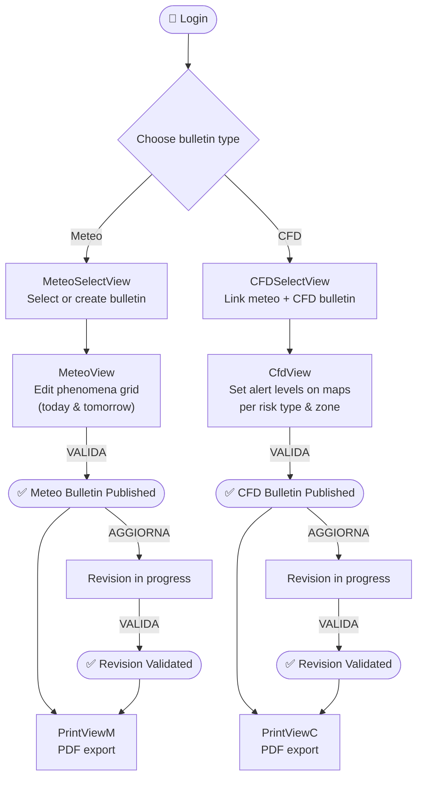
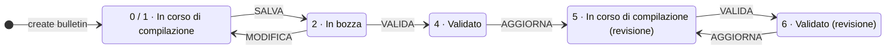

<div align="center">

# Bollettino Multirischio — Frontend

**A Vue 3 single-page application for authoring, validating, and printing  
multi-risk weather and civil-protection bulletins.**

[](https://vuejs.org/)
[](https://vitejs.dev/)
[](https://nodejs.org/)
[](https://leafletjs.com/)
[](https://axios-http.com/)
[](https://socket.io/)
[](#license)

</div>

---

## Table of Contents

1. [Overview](#overview)
2. [Feature Highlights](#feature-highlights)
3. [Tech Stack](#tech-stack)
4. [Repository Layout](#repository-layout)
5. [Quick Start](#quick-start)
6. [Configuration](#configuration)
7. [Available Scripts](#available-scripts)
8. [Application Workflow](#application-workflow)
9. [Documentation Index](#documentation-index)
10. [License](#license)

---

## Overview

**Bollettino Multirischio** is a web front-end developed for regional environmental and civil-protection agencies. The reference deployment is **ARPAV** — *Agenzia Regionale per la Prevenzione e Protezione Ambientale del Veneto* (Veneto Regional Agency for Environmental Prevention and Protection, Italy).

The application gives specialised forecasters and civil-protection operators a single, integrated workspace to:

- Compose and validate **meteorological bulletins** (*Bollettino di Vigilanza Meteo*) across geographic areas, atmospheric phenomena, and altitude bands.
- Compose and validate **CFD alert bulletins** (*Bollettino di Allerta — Centro Funzionale Decentrato*) with colour-coded risk levels per alert zone.
- Visualise alert zones and river-section monitoring data on **interactive Leaflet maps**.
- **Export** both bulletin types to PDF-ready print layouts.
- Collaborate in real time via **WebSocket** push notifications — changes made by one operator are immediately reflected for others.

---

## Feature Highlights

| Domain | Capabilities |
|--------|-------------|
| **Authentication** | JWT login · token renewal · automatic session-expiry redirect |
| **Meteo bulletins** | Create · draft · edit · copy yesterday/today · validate · revise · print |
| **CFD alert bulletins** | Create · draft · edit · copy today→tomorrow · validate · revise · print |
| **Interactive maps** | Choropleth alert-zone maps (Meteo & CFD) · circle-marker river-section overlays |
| **Data import** | Soil state (*Stato Suolo*) · section levels (*Livello Sezioni*) · rain tables (*Tabelle Pioggia*) |
| **Reference tables** | Thunderstorm thresholds · precipitation thresholds · hydrological thresholds · alert-area map |
| **Print** | Landscape & portrait PDF export for Meteo; dedicated CFD print view |
| **Real-time** | Socket.IO channel for live alert-level updates across concurrent sessions |

---

## Tech Stack

| Layer | Technology | Version |
|-------|-----------|---------|
| Framework | [Vue 3](https://vuejs.org/) — Composition API, `<script setup>` | 3.3+ |
| Build tool | [Vite](https://vitejs.dev/) | 4.x |
| UI component library | [UIkit](https://getuikit.com/) | 3.16 |
| Maps | [Leaflet](https://leafletjs.com/) | 1.9 |
| HTTP client | [Axios](https://axios-http.com/) | 1.x |
| Charts | [Chart.js](https://www.chartjs.org/) | 2.9 |
| Rich-text editor | [TinyMCE](https://www.tiny.cloud/) | 5.x |
| Date/time | [Moment.js](https://momentjs.com/) | latest |
| Date picker | [@vuepic/vue-datepicker](https://vue3datepicker.com/) | 10.x |
| Icons | [Font Awesome 6](https://fontawesome.com/) via `@fortawesome/vue-fontawesome` | 6.x |
| Notifications | [Toastr](https://codeseven.github.io/toastr/) | 2.x |
| State management | [Pinia](https://pinia.vuejs.org/) | 2.x |
| Real-time | [Socket.IO client](https://socket.io/) | 4.x |
| Auth | [jwt-decode](https://github.com/auth0/jwt-decode) | 3.x |
| Language | JavaScript (ES2022+) · TypeScript *(type-check only)* | — |

---

## Repository Layout

```text
bollettino_cfd_frontend/
├── index.html                    # Application entry point — mounts #app
├── vite.config.ts                # Vite bundler configuration
├── tsconfig.app.json             # TypeScript config (type-check only, not compiled)
├── package.json                  # Dependencies & scripts
│
├── public/
│   ├── config.json               # ⚙️  Runtime server URL configuration
│   └── maintenance.html
│
├── css/                          # Global stylesheets (dashboard, personal, table)
├── img/                          # Static assets & favicon
│
├── documents/                    # Deployment reference material
│   ├── frontend_install.md
│   └── nginx/
│       └── multirischio_front    # nginx virtual-host configuration template
│
└── src/
    ├── main.js                   # App bootstrap, global plugin registration
    ├── App.vue                   # Root component — nav shell, auth guard
    ├── authorizationLink.js      # Legacy Angular-style auth helper
    │
    ├── assets/                   # Build-time config presets
    │   ├── config_local.json
    │   ├── config_remote.json
    │   └── config.json
    │
    ├── router/
    │   └── index.js              # Vue Router route definitions
    │
    ├── services/                 # API & shared-state service classes
    │   ├── service.js            # Base URL resolution from localStorage
    │   ├── AppService.js         # Authentication & token renewal
    │   ├── MeteoService.js       # Meteo bulletin REST endpoints
    │   ├── CfdService.js         # CFD bulletin REST endpoints
    │   ├── LeafletService.js     # Singleton Leaflet map manager
    │   ├── ShareService.js       # Singleton cross-component shared state
    │   ├── PrintMeteoService.js  # Meteo print data fetching
    │   └── PrintCfdService.js    # CFD print data fetching
    │
    ├── utils/
    │   └── CommonFunction.js     # Date formatting & bulletin label helpers
    │
    ├── components/
    │   └── RevisioneModal.vue    # Bulletin revision date/time modal
    │
    └── views/
        ├── LoginView.vue
        ├── BaseView.vue
        ├── MeteoSelectView.vue
        ├── MeteoView.vue         # Meteo bulletin editor (scrolling grid)
        ├── CFDSelectView.vue
        ├── CfdView.vue           # CFD bulletin editor (dynamic risk cards)
        ├── PrintViewM.vue        # Meteo print view (new window)
        ├── PrintViewC.vue        # CFD print view (new window)
        ├── StatsView.vue         # Statistics dashboard (placeholder)
        ├── TabellaTemporali.vue
        │
        ├── CfdCards/             # Dynamic risk-type card sub-components
        │   ├── SimpleCfdCard.vue
        │   ├── IdroCfdCard.vue
        │   ├── IdroGeoCfdCard.vue
        │   └── TendenzaCfdCard.vue
        │
        └── MapComponents/
            ├── CfdMapComponent.vue
            ├── MeteoMapComponent.vue
            └── TablePioggie.vue
```

---

## Quick Start

### Prerequisites

| Requirement | Minimum version |
|-------------|----------------|
| Node.js | 18 LTS |
| npm | 9 |
| Backend API (Flask) | Reachable via HTTP and WebSocket |

### 1 — Install dependencies

```bash
npm install
```

### 2 — Configure server URLs

Edit `public/config.json` to point to your backend (this file is read at runtime and never bundled):

```json
{
  "LOGIN_URL": "http://<your-backend>:5000",
  "SERVER_URL": "http://<your-backend>:5000",
  "WS_URL":    "ws://<your-backend>:5000"
}
```

### 3 — Start the development server

```bash
npm run dev
```

Open `http://localhost:5173` (or the port printed by Vite) in your browser.

### 4 — Build for production

```bash
npm run build
```

The compiled assets are written to `dist/`. Deploy the contents of that directory to your nginx web root — see [INSTALLATION.md](INSTALLATION.md) for the full deployment guide.

---

## Configuration

Server URLs are resolved at **runtime** — `LoginView` reads `public/config.json` on startup and stores the values in `localStorage`, from where all service classes pick them up. This decouples the deployment configuration from the build artifact: a single `dist/` bundle can be pointed at any backend simply by editing `config.json` on the server, without rebuilding.

| Key | Purpose |
|-----|---------|
| `LOGIN_URL` | Authentication endpoint base (`/login`, `/get/new/token`) |
| `SERVER_URL` | All REST API calls |
| `WS_URL` | WebSocket connection for real-time updates |

Three configuration presets are included in `src/assets/` as starting-point templates:

| File | Intended for |
|------|-------------|
| `config_local.json` | Local development — `localhost:5000` |
| `config_remote.json` | Staging or production server |
| `config.json` | Build-time fallback |

> **Tip — zero-rebuild deployments:** Keep the production `config.json` outside your web root (e.g. `/etc/multirischio/config.json`) and copy it in as the final step of your deploy pipeline. This way a backend migration requires no code changes or builds.

---

## Available Scripts

| Command | Description |
|---------|-------------|
| `npm run dev` | Start Vite dev server with Hot Module Replacement |
| `npm run build` | Type-check with `vue-tsc`, then build for production |
| `npm run build-only` | Build for production without type-checking |
| `npm run type-check` | Run TypeScript type-checking only (no output) |
| `npm run lint` | Run ESLint across all source files and auto-fix |
| `npm run format` | Run Prettier on `src/` |
| `npm run preview` | Preview the production build locally |

---

## Application Workflow



### Bulletin validation lifecycle

Bulletins progress through a numbered state machine:



---

## Documentation Index

| Document | Description |
|----------|-------------|
| [ARCHITECTURE.md](ARCHITECTURE.md) | System diagram, component hierarchy, service layer design, state management, map architecture, auth & print flows |
| [INSTALLATION.md](INSTALLATION.md) | Step-by-step local setup, production build, nginx configuration, deploy checklist, and troubleshooting |
| [API_SERVICES.md](API_SERVICES.md) | Complete reference of every backend REST endpoint and WebSocket event consumed by the frontend |
| [COMPONENTS.md](COMPONENTS.md) | Props, emitted events, internal state, and responsibilities for every Vue component and utility |
| [USER_GUIDE.md](USER_GUIDE.md) | End-user and operator guide: login, bulletin authoring, map editing, validation workflow, and printing |

---

## License

See [LICENSES.md](../LICENSES.md) in the project root for a full list of third-party dependency licences.

---

<div align="center">
<sub>Built for ARPAV — Agenzia Regionale per la Prevenzione e Protezione Ambientale del Veneto</sub>
</div>
