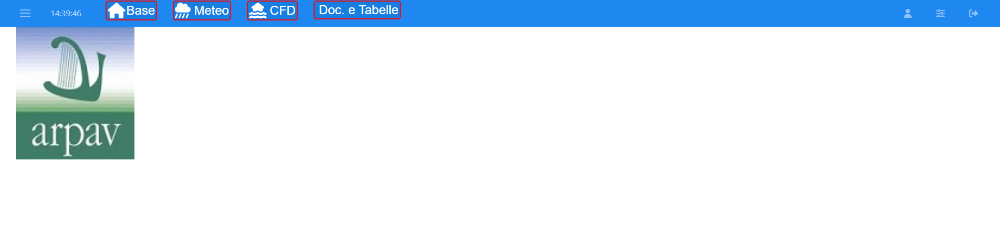
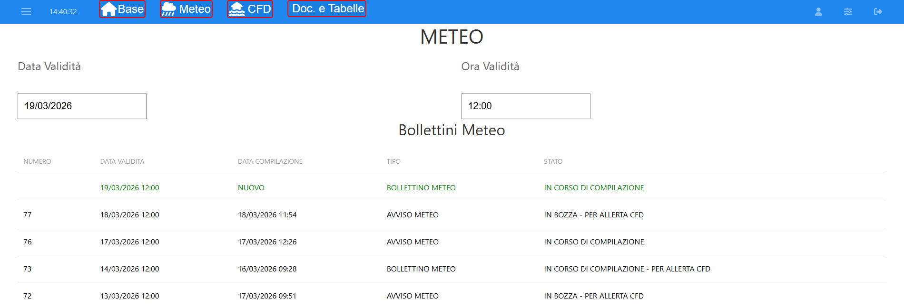
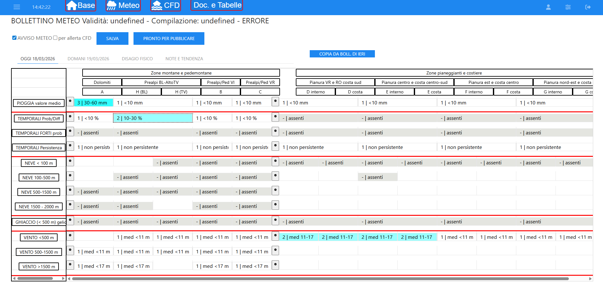
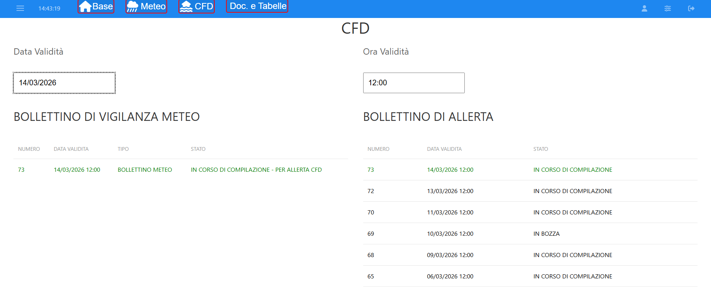
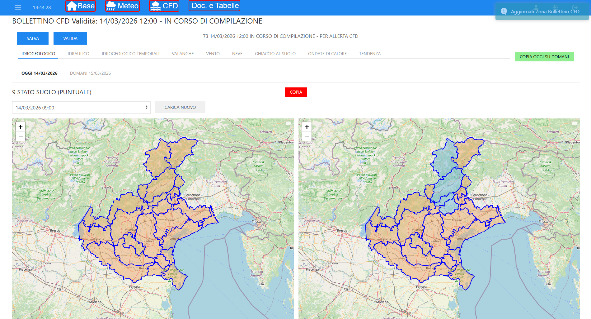
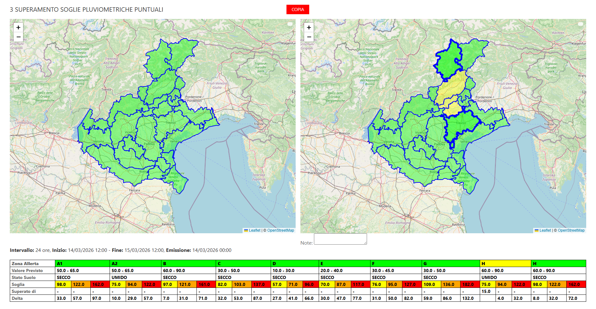
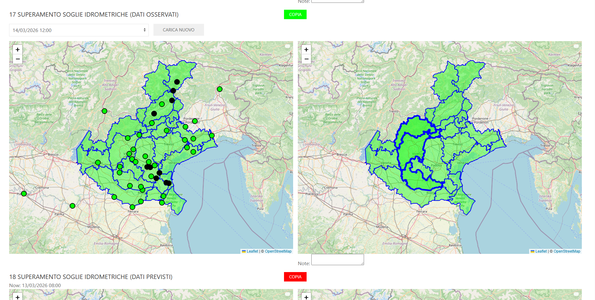

# User Guide

[← Back to README](README.md) · [Architecture](ARCHITECTURE.md) · [Installation](INSTALLATION.md) · [API Services](API_SERVICES.md) · [Components](COMPONENTS.md)

> **Audience:** Forecasters and civil-protection operators who use the application to compose, validate, and print meteorological and alert bulletins.

This guide covers every step of the daily bulletin workflow — from login through composition, validation, and PDF export — without requiring any knowledge of the underlying technology.

---

## Table of Contents

1. [Getting Started — Login](#getting-started--login)
2. [Screenshot Checklist](#screenshot-checklist)
3. [Application Layout](#application-layout)
4. [Meteo Bulletin Workflow](#meteo-bulletin-workflow)
   - [1. Select or Create a Meteo Bulletin](#1-select-or-create-a-meteo-bulletin)
   - [2. Fill in the Meteo Grid](#2-fill-in-the-meteo-grid)
   - [3. Tabs: Physical Discomfort and Notes/Tendency](#3-tabs-physical-discomfort-and-notestendency)
   - [4. Save and Validate](#4-save-and-validate)
   - [5. Revise a Published Bulletin](#5-revise-a-published-bulletin)
5. [CFD Alert Bulletin Workflow](#cfd-alert-bulletin-workflow)
   - [1. Select or Create a CFD Bulletin](#1-select-or-create-a-cfd-bulletin)
   - [2. Fill in Alert Levels per Zone](#2-fill-in-alert-levels-per-zone)
   - [3. Maps](#3-maps)
   - [4. Soil State and Section Levels](#4-soil-state-and-section-levels)
   - [5. Copy Today to Tomorrow](#5-copy-today-to-tomorrow)
   - [6. Validate and Publish](#6-validate-and-publish)
6. [Printing Bulletins](#printing-bulletins)
7. [Reference Tables (Doc. e Tabelle)](#reference-tables-doc-e-tabelle)
8. [Bulletin States Reference](#bulletin-states-reference)
9. [Keyboard & Usability Tips](#keyboard--usability-tips)

---

## Getting Started — Login

1. Open the application URL in your browser.
2. On the login screen, enter your **username** and **password**.
3. Press **Enter** or click **LOG IN**.
4. If credentials are correct, the main interface loads with the navigation bar at the top.

> If you see **"VERSIONE DI TEST"** at the top of the login form, you are connected to a test/staging environment.

### Session expiry

The navigation bar displays a token expiry countdown. When you notice it is about to expire, click it to automatically renew your session without losing your work.

If your session has already expired and you receive a *"Credenziali scadute"* message, you will be redirected to the login page. Log in again to continue.

---

## Screenshot Checklist

Place all screenshots in `docs/screenshots/` using these exact names:

| File name | Capture this screen | Section reference |
|-----------|---------------------|-------------------|
| `01-login.png` | Login form before authentication | Getting Started — Login |
| `02-base-home.png` | Base page with navbar expanded | Application Layout |
| `03-meteo-select.png` | Meteo bulletin selection table | Meteo Workflow 1 |
| `04-meteo-editor-grid.png` | Meteo grid editor with OGGI or DOMANI selected | Meteo Workflow 2 |
| `05-cfd-select.png` | CFD two-table selector (meteo + CFD) | CFD Workflow 1 |
| `06-cfd-editor-maps-a.png` | CFD map view #1 (first risk tab) | CFD Workflow 2/3 |
| `06-cfd-editor-maps-b.png` | CFD map view #2 (second risk tab) | CFD Workflow 2/3 |
| `06-cfd-editor-maps-c.png` | CFD map view #3 (third risk tab) | CFD Workflow 2/3 |

See `docs/screenshots/README.md` for capture quality guidelines.

---

## Application Layout

```
┌─────────────────────────────────────────────────────────┐
│  [≡]  Base   Meteo   CFD   Doc. e Tabelle   [user info] │  ← Navigation bar
└─────────────────────────────────────────────────────────┘
│ (sidebar, when open)                                     │
│  ← collapsible panel                                     │
├──────────────────────────────────────────────────────────┤
│                                                          │
│                   Main content area                      │
│           (changes based on selected section)            │
│                                                          │
└──────────────────────────────────────────────────────────┘
```



### Navigation bar buttons

| Button | What it opens |
|--------|--------------|
| **Base** | Home / landing page |
| **Meteo** | Meteo bulletin selection and editing |
| **CFD** | CFD alert bulletin selection and editing |
| **Doc. e Tabelle** | Dropdown with reference tables (see §6) |

---

## Meteo Bulletin Workflow

### 1. Select or Create a Meteo Bulletin

Click **Meteo** in the navigation bar. The bulletin selector screen opens.

**To work on an existing bulletin:**
- The table lists all recent bulletins with their date, type, and state.
- Rows are colour-coded:
  - Normal colour: current/recent bulletins
  - Greyed out: older bulletins
- Click any row to open that bulletin for editing.

**To create a new bulletin:**
1. Set the **Data Validità** (validity date) in `DD/MM/YYYY` format.
2. Set the **Ora Validità** (validity time) in `HH:MM` format.
3. Click the **Nuovo** / create button — a new draft bulletin is created for that validity date.

> A bulletin labelled **AVVISO METEO** indicates it is a weather *advisory* rather than a standard forecast bulletin. The **per allerta CFD** checkbox links it to a civil-protection alert bulletin.



---

### 2. Fill in the Meteo Grid

The meteo editor shows a **scrollable grid**:

- **Rows** = meteorological phenomena × altitude bands (e.g., *Pioggia - montagna*, *Neve - pianura*).
- **Columns** = geographic alert areas.

**Editing a cell:**
1. Click the cell for the desired phenomenon + area combination.
2. Select the appropriate intensity level from the dropdown (or colour-coded button set).
3. The value is saved automatically (or on the SALVA action, depending on configuration).

The left sidebar (phenomenon labels) and the grid scroll **in sync** — you always know which row you are on.

**OGGI / DOMANI tabs:**
- The grid has two tabs: **OGGI** (today) and **DOMANI** (tomorrow).
- Switch between them by clicking the tab labels.

**Copy buttons:**
- **COPIA da Boll. di IERI** (on the OGGI tab): copies all grid values from yesterday's bulletin into today's.
- **COPIA da OGGI** (on the DOMANI tab): copies today's grid values to tomorrow.

These shortcuts significantly reduce data entry when conditions are similar across days.



---

### 3. Tabs: Physical Discomfort and Notes/Tendency

**DISAGIO FISICO tab:**
Select physical discomfort levels (e.g. heat, cold) for defined discomfort zones.

**NOTE e TENDENZA tab:**
- **Fenomeno notes**: free-text descriptions for each atmospheric phenomenon.
- **Tendenza**: multi-day/free-text tendency section visible in the printed bulletin.
- **Descrizione meteo**: overall situation description.
- **Evidenza**: highlighted elements for emphasis.

All text fields support standard text entry. The TinyMCE rich-text editor is used for formatted text blocks.

---

### 4. Save and Validate

The bulletin passes through the following states:

#### State progression — Meteo

```
(new)
  │
  ▼  [SALVA]
IN BOZZA (bozza = draft, validazione = 2)
  │
  ▼  [PRONTO per Pubblicare]
PRONTO (validazione = 3 — ready for supervisor review)
  │
  ▼  [supervisor validates]
VALIDATO (validazione = 4)
```

| Button | When visible | Action |
|--------|-------------|--------|
| **SALVA** | `validazione ≤ 1` | Saves current data as draft |
| **MODIFICA** | `validazione = 2` | Unlocks the bulletin for further editing |
| **PRONTO per Pubblicare** | `validazione < 4` | Marks bulletin as ready for validation |
| **AGGIORNA** | `validazione = 4 or 6` | Opens revision dialog |
| **VALIDA** | `validazione = 5` | Re-validates after revision |

> Both **AVVISO METEO** and **per allerta CFD** checkboxes are only editable when `validazione ≤ 1` (bulletin is in editing state).

---

### 5. Revise a Published Bulletin

If a published bulletin needs correction after validation:

1. Click **AGGIORNA**. The *Revisiona Bollettino* modal opens.
2. Set the new **Data Validità** and **Ora Validità**.
3. Click **Revisiona**. The bulletin enters revision state (`validazione = 5`).
4. Make the necessary edits.
5. Click **VALIDA** when done. The bulletin is re-published (`validazione = 6`).

---

## CFD Alert Bulletin Workflow

### 1. Select or Create a CFD Bulletin

Click **CFD** in the navigation bar. The CFD selection screen shows **two parallel tables**:

| Left table | Right table |
|-----------|-------------|
| Bollettini di Vigilanza Meteo | Bollettini di Allerta (CFD) |

To link a meteo bulletin to a new CFD bulletin:
1. Set the **Data Validità** at the top.
2. Click the desired **Meteo bulletin** row on the left.
3. Click the desired (or new) **CFD bulletin** row on the right.
4. Open the CFD editor.

> A CFD bulletin references a meteo bulletin. The meteo data is displayed on the left maps of each risk card as context.



---

### 2. Fill in Alert Levels per Zone

The CFD editor shows **tabs**, one per risk type (e.g., *Idrogeologico*, *Idraulico*, *Temporali*, *Neve e ghiaccio*, *Valanghe*, *Vento*).

For each risk tab:
- The display is divided into **OGGI** and **DOMANI** tabs.
- The map on the **left** shows the meteo context (read-only colours).
- The map on the **right** shows the CFD alert levels (editable).

**To assign an alert level:**
1. Click a zone on the right (CFD) map.
2. Select the alert level from the popup or panel (colours: green = none, yellow = ordinary, orange = moderate, red = severe, etc.).
3. The zone updates immediately.

Some risk types have an **Attivo** checkbox. When unchecked, the risk is considered inactive for that bulletin and its alert levels are ignored.





---

### 3. Maps

Both map panels are interactive Leaflet maps centred on the **Veneto region** (Italy). 

- **Hover** over a zone to see its name as a tooltip.
- **Click** a zone (on the CFD map, when editing is enabled) to change its alert level.
- Zones are coloured according to the current alert level assigned.

**River section markers** (small coloured circles) may appear on hydro/hydraulic risk maps, showing the status of monitored river cross-sections.

---

### 4. Soil State and Section Levels

For hydrological risks (`id_rischio = 7` Idrogeologico, `id_rischio = 17` Idraulico):

**Stato Suolo (Soil State):**
- A dropdown shows available soil-state snapshots (timestamped).
- Select the most appropriate snapshot for current conditions.
- Click **CARICA NUOVO** to trigger a fresh import from the monitoring system.

**Livello Sezioni (Section Levels):**
- Similar dropdown for river cross-section level snapshots.
- Click **CARICA NUOVO** to import updated levels.

**Run Modellistica:**
- For `id_rischio = 18`, the date of the last hydrological model run is displayed for reference.

---

### 5. Copy Today to Tomorrow

The **COPIA OGGI SU DOMANI** button (top right of the CFD editor) copies all alert levels set for today's period to tomorrow's period in a single action.

Use this when forecast conditions are expected to persist into the next day.

---

### 6. Validate and Publish

The CFD bulletin follows the same state machine as the meteo bulletin:

| Button | When visible | Action |
|--------|-------------|--------|
| **SALVA** | `validazione ≤ 1` | Save draft |
| **MODIFICA** | `validazione ≥ 2` | Re-open for editing |
| **VALIDA** | `validazione < 4` | Validate (publish) |
| **AGGIORNA** | `validazione = 4 or 6` | Open revision dialog |

---

## Printing Bulletins

### Print Meteo Bulletin

1. From the navigation bar, click **Doc. e Tabelle** → **STAMPA METEO** (or navigate directly to `/stampameteo`).
2. A new browser tab opens with the print view.
3. Select the bulletin from the dropdown.
4. Click:
   - **Stampa Orizzontale** for landscape PDF layout.
   - **Stampa Verticale** for portrait PDF layout.
5. The PDF is downloaded automatically.


### Print CFD Bulletin

1. Navigate to `/stampacfd`.
2. Select the CFD bulletin from the dropdown.
3. Click **Stampa**.
4. The PDF is generated server-side and downloaded.


---

## Reference Tables (Doc. e Tabelle)

The **Doc. e Tabelle** menu in the navigation bar provides quick access to reference PDFs and HTML tables:

| Menu item | Content |
|-----------|---------|
| **Tab. TEMPORALI** | Thunderstorm alert criteria table |
| **Tab. PRECIPITAZIONI** | Precipitation threshold table |
| **Tab. SOGLIE PREC** | Hydrological/pluviometric threshold table |
| **AREE ALLERTA** | Map of alert areas |

All items open in a new browser tab.

---

## Bulletin States Reference

| State code | Label | Meaning | Can be edited by operator |
|-----------|-------|---------|--------------------------|
| `0` | IN CORSO DI COMPILAZIONE | Newly created, open | Yes |
| `1` | IN CORSO DI COMPILAZIONE | Editing after re-open | Yes |
| `2` | IN BOZZA | Saved as draft | No (use MODIFICA) |
| `4` | VALIDATO | Validated and published | No (use AGGIORNA) |
| `5` | IN CORSO DI COMPILAZIONE (revisione) | Revision in progress | Yes |
| `6` | VALIDATO (revisione) | Re-validated after revision | No |

---

## Keyboard & Usability Tips

| Tip | Detail |
|-----|--------|
| **Enter key at login** | Press Enter in the username or password field to submit the login form |
| **Tab navigation** | Standard tab key navigates between form inputs in the grid |
| **Scroll synchronisation** | The meteo grid sidebar and data area scroll together — use the scrollbar on either panel |
| **Token timer** | Click the token timer in the nav bar before it reaches zero to avoid being logged out mid-session |
| **Multiple windows** | Print views open in new browser tabs; the main editor and print view can remain open simultaneously |
| **win_token** | Each browser window has a unique token to prevent accidental overwriting between concurrent sessions |

---

[↑ Back to top](#user-guide) · [← Back to README](README.md)
